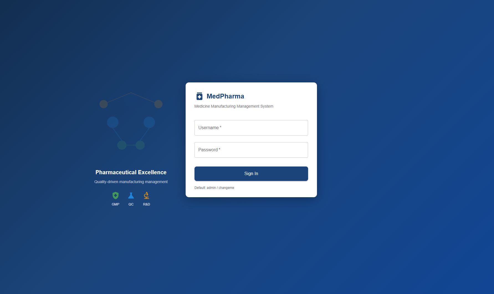

# MedPharma

## Cloud-Native Pharmaceutical Platform

**AWS · Terraform · Kubernetes · EKS · Docker · GitHub Actions · ArgoCD · Java · Spring Boot · React · PostgreSQL**

> A full-stack cloud engineering project demonstrating how to design, provision, secure, containerize, deploy, and operate a Kubernetes-based application platform on AWS using Infrastructure as Code and GitOps.

---

## 👋 What I Built

**MedPharma** is a cloud-native pharmaceutical management platform I designed and engineered to demonstrate practical cloud infrastructure and DevOps skills.

Rather than building only an application, I built the surrounding **cloud platform required to run it**.

The project brings together:

* AWS cloud architecture
* Terraform Infrastructure as Code
* Kubernetes and Amazon EKS
* Containerized microservices
* PostgreSQL
* GitHub Actions CI/CD
* Amazon ECR
* ArgoCD GitOps
* IAM and OIDC authentication
* Secrets management
* Network segmentation
* Application observability
* Cost-aware infrastructure lifecycle management

The result is an architecture where **infrastructure, application delivery, and Kubernetes configuration are all managed through code and version control.**

---

# 🧠 Engineering Focus

This project was intentionally built around the responsibilities of a modern **Cloud / DevOps / Platform Engineer**.

### Infrastructure

**Terraform → AWS VPC → EKS → RDS → ECR → IAM**

### Application

**React → Spring Boot → PostgreSQL**

### Delivery

**GitHub → GitHub Actions → Docker → ECR**

### Deployment

**GitOps → ArgoCD → Kubernetes → EKS**

### Security

**IAM → OIDC → Secrets Manager → Private Networking**

---

# 🏗️ Architecture

```text
                                  USERS
                                    │
                                    ▼
                           ┌─────────────────┐
                           │ Load Balancer   │
                           └────────┬────────┘
                                    │
                                    ▼
                           ┌─────────────────┐
                           │ NGINX Ingress   │
                           └────────┬────────┘
                                    │
                    ┌───────────────┼────────────────┐
                    │               │                │
                    ▼               ▼                ▼
               React UI        API Gateway       Services
                                                    │
                         ┌──────────────────────────┼───────────────┐
                         │                          │               │
                         ▼                          ▼               ▼
                    Auth Service              Drug Catalog      Inventory
                         │                          │               │
                         └──────────────────────────┼───────────────┘
                                                    │
                                                    ▼
                                           PostgreSQL / RDS
```

### AWS Infrastructure

```text
                         AWS VPC
                    10.0.0.0/16
                         │
          ┌──────────────┼──────────────┐
          │              │              │
          ▼              ▼              ▼
       PUBLIC          PRIVATE        PRIVATE
       SUBNETS         EKS TIER       DATABASE TIER
          │              │              │
          │              ▼              ▼
          │             EKS            RDS
          │              │
          │              ▼
          │        Kubernetes
          │        Workloads
          │
          ▼
      Internet
```

The network is divided into separate public, application, and database tiers.

```text
Public
├── 10.0.1.0/24
└── 10.0.2.0/24

Private EKS
├── 10.0.3.0/24
└── 10.0.4.0/24

Private Database
├── 10.0.5.0/24
└── 10.0.6.0/24
```

This design demonstrates practical understanding of **AWS networking, subnetting, routing, security boundaries, and workload isolation.**

---

# ☁️ AWS Infrastructure

Terraform defines the infrastructure required to run the platform.

### AWS Services

| Service             | Purpose                                     |
| ------------------- | ------------------------------------------- |
| **VPC**             | Network architecture and isolation          |
| **EKS**             | Managed Kubernetes control plane            |
| **RDS PostgreSQL**  | Relational application database             |
| **ECR**             | Container image registry                    |
| **IAM**             | Identity and authorization                  |
| **Secrets Manager** | Sensitive configuration                     |
| **S3**              | Terraform state / supporting infrastructure |
| **Load Balancing**  | Application traffic ingress                 |
| **CloudWatch**      | AWS monitoring and logging                  |

The infrastructure is organized into reusable Terraform modules rather than being manually created through the AWS console.

---

# 🏗️ Infrastructure as Code

The infrastructure repository follows a modular Terraform architecture:

```text
infra/
│
├── envs/
│   └── dev/
│
├── modules/
│   ├── vpc/
│   ├── eks/
│   ├── rds/
│   ├── ecr/
│   ├── iam/
│   └── secrets-manager/
│
├── .github/
│   └── workflows/
│
├── providers.tf
├── versions.tf
└── README.md
```

### Terraform Modules

**VPC**

* VPC
* Public/private subnets
* Route tables
* Internet Gateway
* NAT Gateway
* Security groups

**EKS**

* EKS cluster
* Managed node infrastructure
* Kubernetes networking integration
* IAM integration

**RDS**

* PostgreSQL
* Private database networking
* Security groups
* Database configuration

**ECR**

* Container repositories
* Image storage

**IAM**

* Roles
* Policies
* OIDC integration
* Workload permissions

**Secrets Manager**

* Application secrets
* Secure configuration storage

---

# ☸️ Kubernetes & Amazon EKS

EKS provides the Kubernetes platform for the application.

The platform separates application workloads into independently deployable services.

Examples include:

* API Gateway
* Authentication
* Drug Catalog
* Inventory
* Supplier
* Notification
* Frontend

The deployment model follows:

```text
Terraform
    │
    ▼
AWS Infrastructure
    │
    ▼
Amazon EKS
    │
    ▼
Kubernetes
    │
    ▼
Application Workloads
```

This demonstrates practical experience with the intersection of **AWS infrastructure and Kubernetes operations**.

---

# 🔐 Security Architecture

Security was designed into the platform rather than treated as an afterthought.

## GitHub Actions → AWS

The CI/CD architecture uses OIDC-based authentication rather than relying on long-lived AWS access keys.

```text
GitHub Actions
      │
      ▼
GitHub OIDC
      │
      ▼
AWS IAM Role
      │
      ▼
Temporary AWS Credentials
      │
      ▼
AWS Resources
```

This reduces the need to store persistent cloud credentials in CI/CD systems.

## Workload Identity

Kubernetes workloads can use service-account-based identity to obtain AWS permissions through IAM/OIDC.

```text
Kubernetes Pod
      │
      ▼
Service Account
      │
      ▼
OIDC
      │
      ▼
IAM Role
      │
      ▼
AWS Service
```

## Secrets

Sensitive application configuration is separated from source code and designed to use AWS Secrets Manager.

```text
AWS Secrets Manager
        │
        ▼
Kubernetes / Application
        │
        ▼
Runtime Configuration
```

---

# 🔄 CI/CD Pipeline

The project separates infrastructure delivery from application delivery.

## Application Pipeline

```text
Developer
    │
    ▼
GitHub
    │
    ▼
GitHub Actions
    │
    ├── Build
    ├── Test
    └── Docker Build
    │
    ▼
Amazon ECR
    │
    ▼
GitOps Repository
    │
    ▼
ArgoCD
    │
    ▼
Amazon EKS
```

## Infrastructure Pipeline

```text
Terraform Code
      │
      ▼
GitHub Actions
      │
      ├── terraform fmt
      ├── terraform validate
      ├── security checks
      └── terraform plan
      │
      ▼
Review
      │
      ▼
Terraform Apply
      │
      ▼
AWS
```

This provides a repeatable workflow for infrastructure changes rather than relying on manual configuration.

---

# 🚀 GitOps with ArgoCD

Kubernetes desired state is maintained in Git.

```text
Git Repository
      │
      ▼
Desired Kubernetes State
      │
      ▼
ArgoCD
      │
      ▼
EKS
      │
      ▼
Running Workloads
```

ArgoCD continuously reconciles the Kubernetes environment against the configuration stored in Git.

This creates a clear separation:

> **Terraform manages cloud infrastructure.
> GitOps manages Kubernetes application state.**

---

# 🐳 Containerization

Application services are packaged as Docker containers.

```text
Source Code
    │
    ▼
Docker Build
    │
    ▼
Container Image
    │
    ▼
Amazon ECR
    │
    ▼
ArgoCD / Kubernetes
    │
    ▼
EKS
```

This creates a consistent application delivery path from source code to Kubernetes.

---

# 📊 Observability

The platform incorporates operational visibility across the infrastructure and application layers.

Technologies and capabilities include:

* CloudWatch
* Kubernetes workload status
* Container logs
* Application health checks
* Grafana
* Infrastructure metrics

The objective is to make failures and system behavior observable rather than relying exclusively on manual investigation.

---

# 💰 Cost-Aware Engineering

One of the practical lessons of building on AWS is that production-style infrastructure can generate recurring costs.

MedPharma was deployed to AWS during development and used to validate the architecture and application.

After validation, the demonstration environment was **decommissioned to eliminate unnecessary recurring cloud infrastructure costs**.

The infrastructure itself remains defined through Terraform and can be recreated when needed.

This demonstrates an important operational principle:

> **Cloud infrastructure should have a lifecycle — provision it when needed, validate it, and decommission it when it no longer provides sufficient value.**

---

# 📸 Application Screenshots

The following screenshots show the completed application during development and validation.

### Login



### Dashboard


### Drug Catalog


### Distribution


### Inventory


### Quality Control


### Reports


> **Deployment status:** The application was deployed and validated during development. The AWS demonstration environment is no longer running because it was intentionally decommissioned to eliminate ongoing portfolio infrastructure costs.

---

# 🧪 Infrastructure Validation

The infrastructure can be validated with standard Terraform workflows:

```bash
terraform fmt -check
terraform validate
terraform plan
```

Terraform state can be inspected with:

```bash
terraform state list
terraform state show <resource>
```

The project is designed around **declarative infrastructure and reproducibility** rather than manual AWS configuration.

---

# 📁 Repository Architecture

MedPharma is separated into independent repositories.

| Repository   | Purpose                                    |
| ------------ | ------------------------------------------ |
| **infra**    | AWS infrastructure and Terraform           |
| **backend**  | Java / Spring Boot services                |
| **frontend** | React application                          |
| **gitops**   | Kubernetes, Helm, and ArgoCD configuration |

This separation reflects a real-world engineering model where application code, infrastructure, and deployment configuration have independent lifecycles.

---

# 🧰 Technology Stack

### Cloud

**AWS · VPC · EKS · RDS · ECR · IAM · S3 · Secrets Manager · CloudWatch**

### Infrastructure

**Terraform · Terraform Modules · Infrastructure as Code**

### Containers

**Docker · Amazon ECR**

### Kubernetes

**Kubernetes · Amazon EKS · Helm · NGINX Ingress**

### CI/CD

**GitHub Actions**

### GitOps

**ArgoCD**

### Backend

**Java 17 · Spring Boot · Microservices**

### Frontend

**React**

### Database

**PostgreSQL**

---

# 🎯 What This Project Demonstrates

This project demonstrates practical experience across the following engineering areas:

### ☁️ Cloud Engineering

* AWS architecture
* VPC design
* Subnetting
* Routing
* Security groups
* EKS
* RDS
* ECR
* Load balancing

### 🏗️ Infrastructure Engineering

* Terraform
* Reusable modules
* Infrastructure lifecycle management
* Declarative configuration
* Environment separation
* Terraform validation

### ☸️ Kubernetes

* EKS
* Kubernetes workloads
* Services
* Ingress
* Helm
* Service accounts
* GitOps

### 🔄 DevOps

* GitHub Actions
* CI/CD
* Docker
* ECR
* Automated validation
* Deployment automation

### 🔐 Cloud Security

* IAM
* OIDC
* Workload identity
* Secrets management
* Private networking
* Security boundaries

### 📈 Operations

* Logging
* Monitoring
* Health checks
* Infrastructure observability
* Cost management
* Reproducible deployments

---

# 🧑‍💻 Engineering Decisions

Several design decisions were intentional:

### Infrastructure as Code

AWS infrastructure is defined through Terraform instead of being dependent on manual console configuration.

### Modular Terraform

Infrastructure is broken into reusable modules so individual platform components can be maintained independently.

### Private Data Tier

The database is isolated from the public network and accessed through controlled application paths.

### OIDC-Based CI/CD

CI/CD authentication avoids depending on long-lived AWS credentials.

### GitOps

Kubernetes desired state is maintained in Git and reconciled through ArgoCD.

### Containerized Services

Application components are packaged as portable containers and delivered through ECR and Kubernetes.

### Cost Control

The AWS demonstration environment was decommissioned after validation rather than generating unnecessary ongoing infrastructure costs.

---

# 📌 Project Status

**Application development and AWS infrastructure validation completed.**

The AWS demonstration environment is currently **decommissioned**.

The repositories preserve:

* Terraform infrastructure
* Kubernetes configuration
* GitOps configuration
* Backend source code
* Frontend source code
* CI/CD workflows
* Application screenshots
* Architecture documentation

The platform can therefore be reviewed as a complete engineering project even though the demonstration AWS environment is not continuously running.

---

# 🔗 Project Structure

```text
MedPharma
│
├── infra
│   ├── Terraform
│   ├── AWS architecture
│   ├── CI/CD
│   └── screenshots
│
├── backend
│   ├── Java 17
│   ├── Spring Boot
│   └── Microservices
│
├── frontend
│   └── React
│
└── gitops
    ├── Kubernetes
    ├── Helm
    └── ArgoCD
```

---

# 🚀 Why I Built MedPharma

The goal was to move beyond isolated tutorials and demonstrate how the individual pieces of cloud engineering fit together into an actual platform.

```text
AWS
 ↓
Networking
 ↓
Terraform
 ↓
Security
 ↓
Containers
 ↓
Kubernetes
 ↓
CI/CD
 ↓
GitOps
 ↓
Observability
 ↓
Application
```

MedPharma represents a hands-on demonstration of **cloud infrastructure, automation, Kubernetes, DevOps, security, and application delivery working together as one system.**

---

## Built by CloudTechs.ai

**Cloud Engineering · Infrastructure as Code · Kubernetes · DevOps · Cloud Security**
